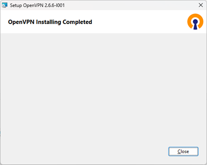
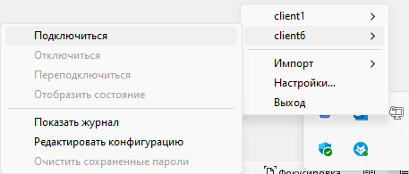

**Инструкция пользователя клиента OpenVPN**

Для настройки клиента необходимо скачать ПО - по адресу [https://openvpn.net/community-downloads/](https://openvpn.net/community-downloads/)

Процедура установки клиентского приложения
1.	Запустить скачанный файл OpenVPN-*.msi и нажать “Install Now”
 
 
 
 

Дождитесь установки и сообщения “OpenVPN Installing Completed” и нажмите “Close”
 

2.	Найдите и запустите приложение ***“OpenVPN GUI”**

3.	Найдите в панели задач приложение **“Графический интерфейс OpenvVPN”**

 

4.	Выполните импорт конфигурации клиента OpenVPN (*.ovpn файл) предоставленный администратором системы:
Импорт --> Импорт файла конфигурации --> Выбрать файл *.ovpn

5.	Выполнить подключение

 

Об успешном подключении будет свидетельствовать **“Зеленная пиктограмма монитора”**  в панели задач 

  

<u>В случае если пиктограмма будет иметь **“Желтый”** цвет, значит имеются проблемы с подключением.</u>
<u>В таком случае прошу обращаться к вашим администраторам системы.</u>
